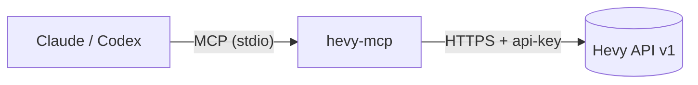

<div align="center">

# hevy-mcp

**Connect Claude, Codex and other AI assistants to your [Hevy](https://www.hevyapp.com) training data.**

[](https://github.com/viniciolimadev/integracao-hevy-ai/actions/workflows/ci.yml)
[](LICENSE)


🇺🇸 English · 🇧🇷 [Português](README.pt-BR.md)

</div>

---

hevy-mcp is a [Model Context Protocol](https://modelcontextprotocol.io) server for the [Hevy Public API](https://api.hevyapp.com/docs/). With it, an AI assistant can read your workout history, analyze your progress, build routines and log body measurements in plain language.



## Contents

- [Features](#features)
- [Requirements](#requirements)
- [Quick start](#quick-start)
- [Client setup](#client-setup)
- [Tools](#tools)
- [Example prompts](#example-prompts)
- [Configuration](#configuration)
- [Troubleshooting](#troubleshooting)
- [Documentation](#documentation)
- [Contributing](#contributing)
- [License](#license)

## Features

- **Full API coverage**: 22 tools for every v1 endpoint, including workouts, routines, folders, exercise templates, exercise history, body measurements and user info.
- **Automatic pagination**: ask for `max_items` and the server walks the pages for you.
- **Resilient requests**: retries with exponential backoff on `429` and `5xx` responses.
- **Exercise search**: find exercise template IDs by name, which the API doesn't support natively.
- **Safe by design**: read, write and overwrite tools carry MCP annotations, so clients can ask for confirmation before changing data.
- **Works with any MCP client**: Claude Code, Claude Desktop, Codex and others.

## Requirements

| Requirement | Notes |
|---|---|
| [Hevy Pro](https://www.hevyapp.com/pro/) | The Public API is only available to Pro users |
| Hevy API key | Generate one at **https://hevy.com/settings?developer** |
| Node.js ≥ 20 | [Download](https://nodejs.org) |

## Quick start

```bash
git clone https://github.com/viniciolimadev/integracao-hevy-ai
cd integracao-hevy-ai
npm install          # also builds to dist/
```

Then register the server with your AI client (see below) and ask:

> *"List my last 5 workouts on Hevy."*

## Client setup

Replace `/path/to/integracao-hevy-ai` with the absolute path of your clone, and `your-key` with your Hevy API key.

<details open>
<summary><b>Claude Code</b></summary>

```bash
claude mcp add hevy -e HEVY_API_KEY=your-key -- node /path/to/integracao-hevy-ai/dist/index.js
```
</details>

<details>
<summary><b>Claude Desktop</b></summary>

Edit `claude_desktop_config.json` (Settings → Developer → Edit Config):

```json
{
  "mcpServers": {
    "hevy": {
      "command": "node",
      "args": ["/path/to/integracao-hevy-ai/dist/index.js"],
      "env": { "HEVY_API_KEY": "your-key" }
    }
  }
}
```
</details>

<details>
<summary><b>Codex (OpenAI)</b></summary>

```bash
codex mcp add hevy --env HEVY_API_KEY=your-key -- node /path/to/integracao-hevy-ai/dist/index.js
```

Or add it to `~/.codex/config.toml`:

```toml
[mcp_servers.hevy]
command = "node"
args = ["/path/to/integracao-hevy-ai/dist/index.js"]
env = { HEVY_API_KEY = "your-key" }
```
</details>

<details>
<summary><b>Other MCP clients</b></summary>

Any client that supports stdio servers works. Use the command `node /path/to/integracao-hevy-ai/dist/index.js` and set the `HEVY_API_KEY` environment variable.
</details>

## Tools

| Group | 🔍 Read | ✏️ Write |
|---|---|---|
| User | `get_user_info` | — |
| Workouts | `list_workouts` · `get_workout` · `get_workout_count` · `get_workout_events` | `create_workout` · `update_workout` ⚠️ |
| Routines | `list_routines` · `get_routine` | `create_routine` · `update_routine` ⚠️ |
| Routine folders | `list_routine_folders` · `get_routine_folder` | `create_routine_folder` |
| Exercises | `list_exercise_templates` · `get_exercise_template` · `get_exercise_history` | `create_exercise_template` |
| Body measurements | `list_body_measurements` · `get_body_measurement` | `create_body_measurement` · `update_body_measurement` ⚠️ |

⚠️ **The `update_*` tools replace the whole resource.** `update_body_measurement` sets every omitted field to `null`.

👉 Parameters and types for each tool are in the **[tool reference](docs/tools.md)**.

## Example prompts

| Goal | Prompt |
|---|---|
| Weekly review | *"Summarize my last 4 weeks of training: sessions per week, total volume and muscle groups trained."* |
| Progression | *"How has my bench press top set progressed over the last 3 months? Any plateaus?"* |
| Programming | *"Create a Push/Pull/Legs routine in a new 'Hypertrophy' folder, 3–4 exercises per day, 8–12 reps."* |
| Logging | *"Log today's workout: squat 3×5 at 100 kg, Romanian deadlift 3×8 at 80 kg."* |
| Body composition | *"Log my body weight today: 82.4 kg. Then show my weight trend this year."* |

## Configuration

| Variable | Required | Default | Description |
|---|---|---|---|
| `HEVY_API_KEY` | ✅ | — | Your Hevy API key |
| `HEVY_BASE_URL` | | `https://api.hevyapp.com` | Override the API base URL, e.g. for testing against a mock |

## Troubleshooting

| Symptom | Cause | Fix |
|---|---|---|
| `HEVY_API_KEY is not set` | Environment variable missing | Add `HEVY_API_KEY` to the `env` of your client config |
| `401` / `403` | Invalid key, or the account isn't Pro | Regenerate the key at hevy.com/settings?developer and check your Pro subscription |
| `400` on create or update | Invalid payload, e.g. a wrong `exercise_template_id` | Look up IDs with `list_exercise_templates` using `search` |
| `409` on `create_body_measurement` | A measurement already exists for that date | Use `update_body_measurement` |
| `429` | Rate limited | The server retries automatically. Space out bulk requests |
| Tools don't appear | Wrong path or project not built | Run `npm run build` and use an **absolute** path to `dist/index.js` |

To debug interactively, use the MCP Inspector:

```bash
HEVY_API_KEY=your-key npx @modelcontextprotocol/inspector node dist/index.js
```

## Documentation

| Document | Content |
|---|---|
| [docs/tools.md](docs/tools.md) | Full tool reference (auto-generated) |
| [docs/architecture.md](docs/architecture.md) | Components, request lifecycle, design decisions |
| [CONTRIBUTING.md](CONTRIBUTING.md) | Development setup and how to add a tool |
| [SECURITY.md](SECURITY.md) | API key handling and vulnerability reporting |
| [CHANGELOG.md](CHANGELOG.md) | Release history |

## Contributing

Contributions are welcome. Read [CONTRIBUTING.md](CONTRIBUTING.md) first.

## Disclaimer

This is an unofficial community project and is not affiliated with or endorsed by Hevy. The Hevy Public API is in an early stage and may change without notice.

## License

[MIT](LICENSE) © viniciolimadev
