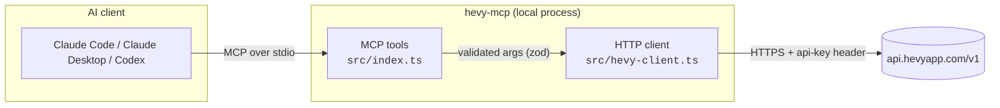
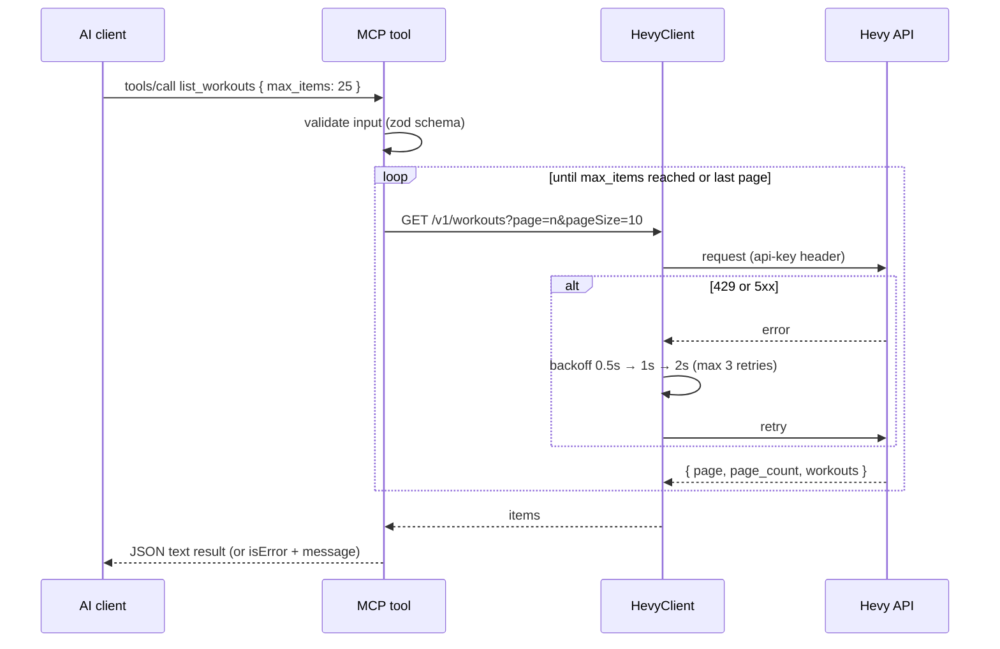

# Architecture

## Overview

The server runs locally as a child process of the AI client. It talks MCP over stdio and does not open any network port.

## Request lifecycle

## Modules

| File | Responsibility |
|---|---|
| `src/index.ts` | Declares the MCP tools, their input schemas (zod), and annotations (read-only / write / destructive) |
| `src/hevy-client.ts` | HTTP layer: authentication, query building, JSON parsing, retries, pagination |
| `scripts/gen-tools-doc.mjs` | Generates [`docs/tools.md`](tools.md) from the live tool schemas |

## Design decisions

| Decision | Reason |
|---|---|
| One tool per API endpoint | Predictable for the model; mirrors the official docs |
| Automatic pagination (`max_items`) | The API caps page sizes (10 for most resources), so the model shouldn't have to loop |
| Client-side `search` for exercise templates | The API has no search endpoint; IDs are required to create workouts and routines |
| Tool annotations (`readOnlyHint`, `destructiveHint`) | Lets clients ask for confirmation before write or overwrite operations |
| Errors returned as `isError` results | The model sees the Hevy error message and can fix its own input |
| No local cache or scheduled sync | Keeps the server stateless; `get_workout_events` covers incremental sync for clients that need it |

## Rate limits

The server only calls the API when a tool is invoked. If you build periodic syncs on top of it, follow Hevy's guidance and **do not schedule requests at minute `xx:00`**. Pick a random minute instead.
